# IconGatherer
Collect and beautify good-looking icons

> Looking forward to contributing together! > 期待共建 <

## AirPods

<p align="left">
  
  
  
  
  
  
  
  
</p>


<p align="left">
  
  
  
  
  
  
  
  
</p>

<p align="left">
  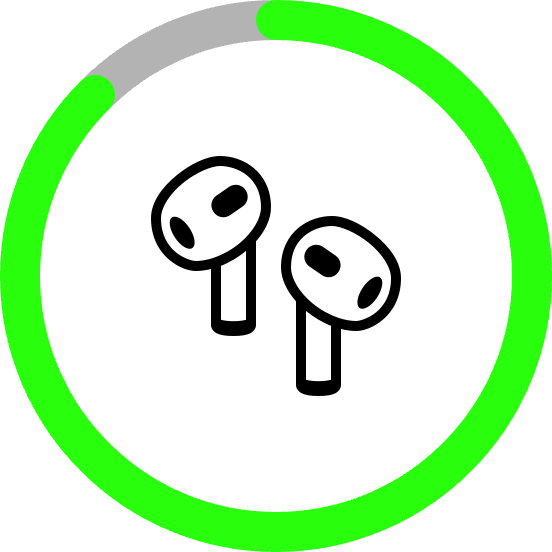
  
  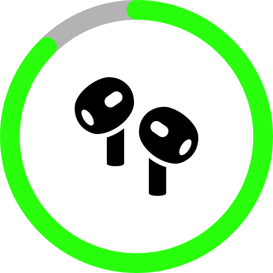
  
  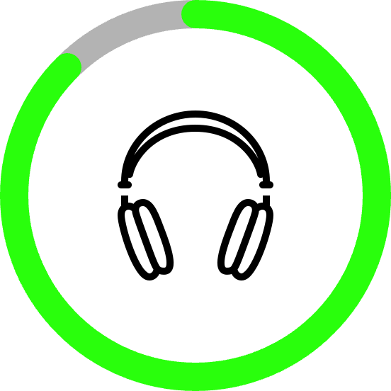
  
  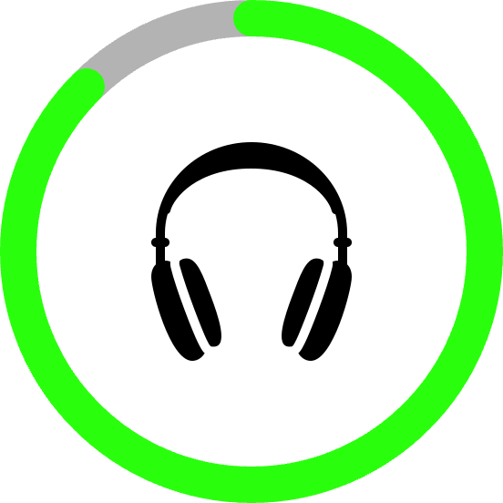
  
</p>

<p align="left">
  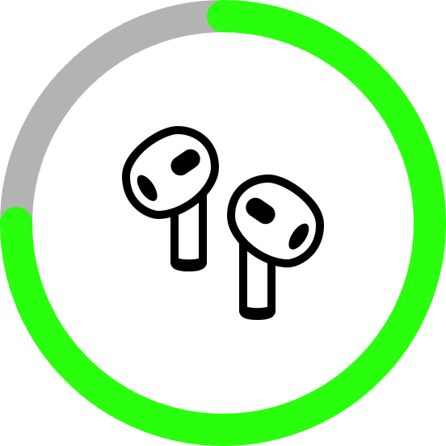
  
  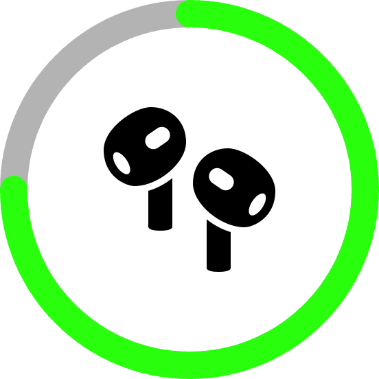
  
  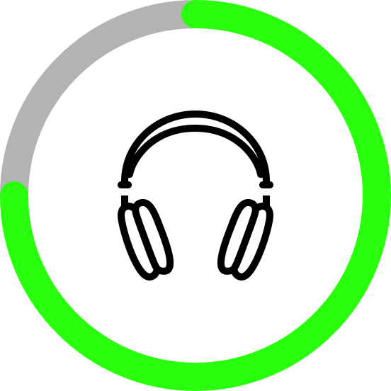
  
  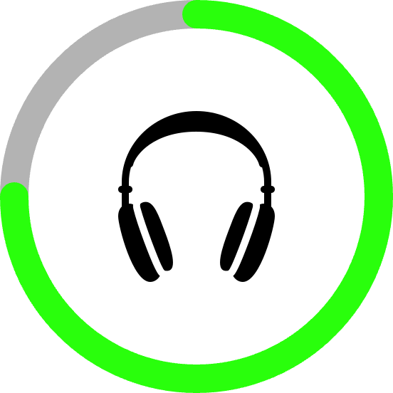
  
</p>

<p align="left">
  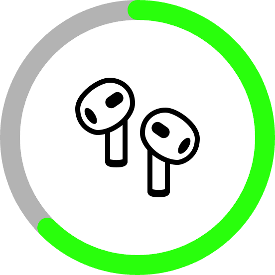
  
  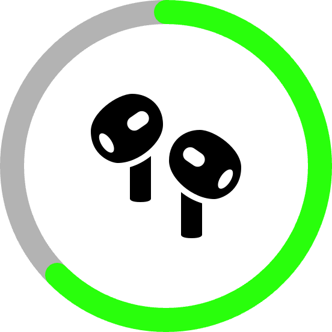
  
  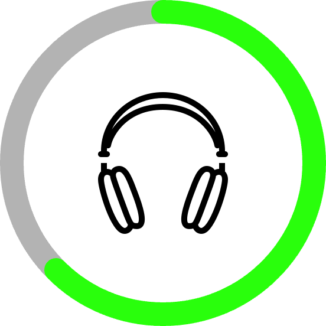
  
  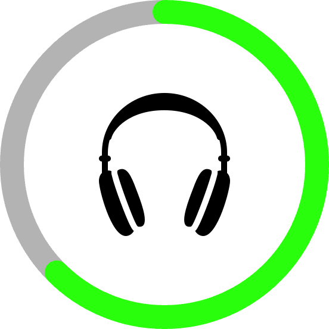
  
</p>


<p align="left">
  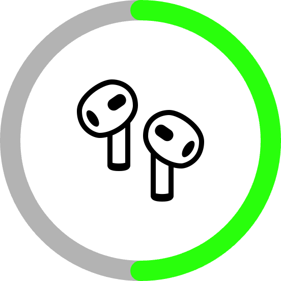
  
  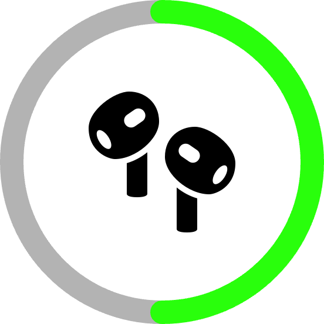
  
  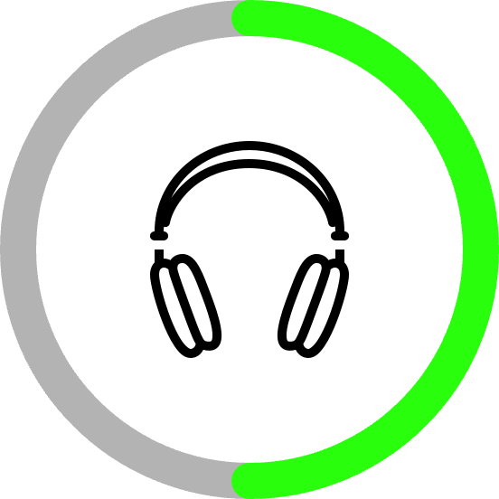
  
  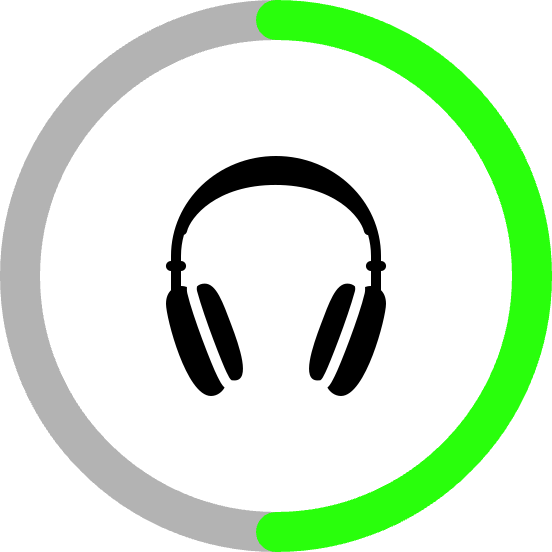
  
</p>


<p align="left">
  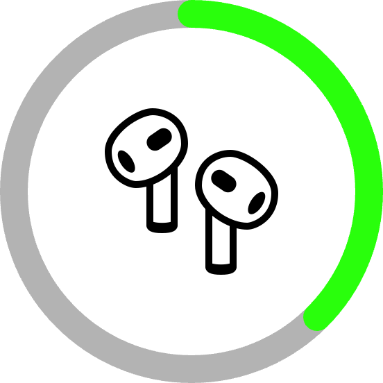
  
  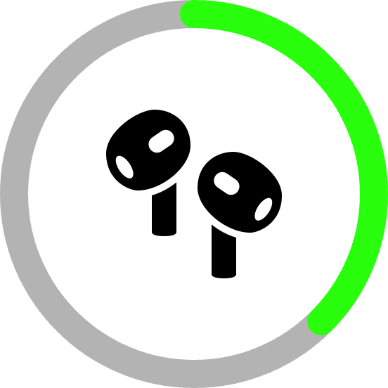
  
  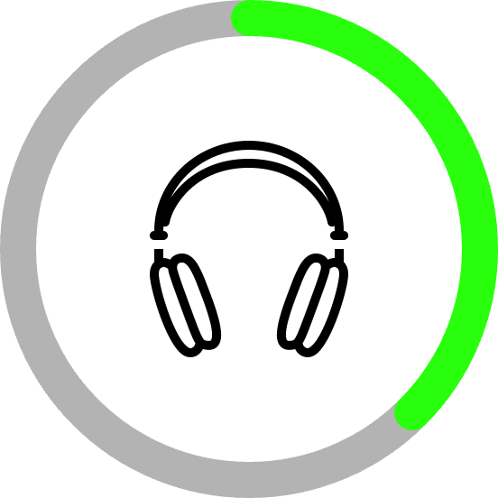
  
  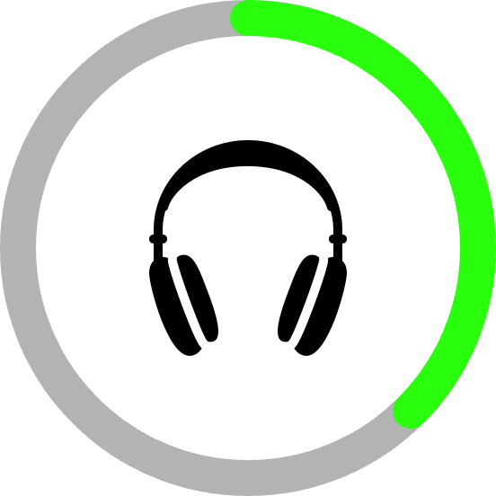
  
</p>


<p align="left">
  
  
  
  
  
  
  
  
</p>

<p align="left">
  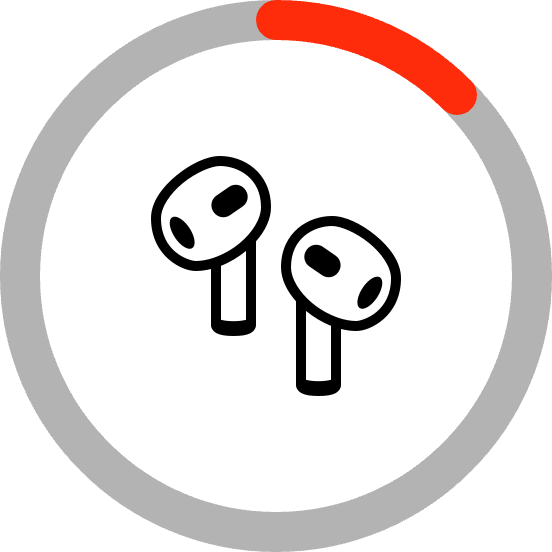
  
  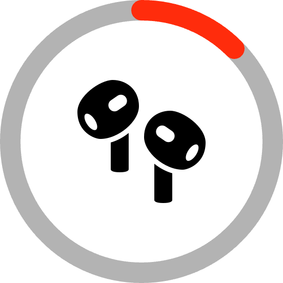
  
  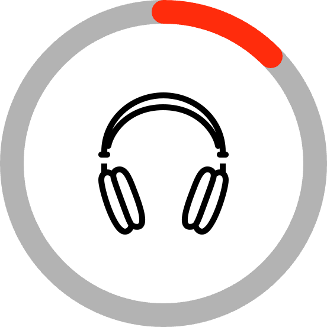
  
  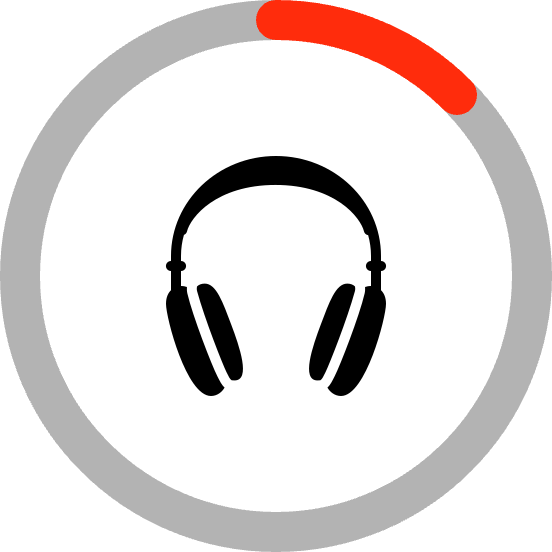
  
</p>


## AppleWatch

<p align="left">
  
  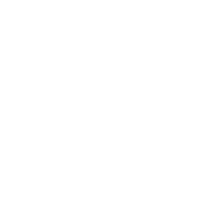
  
  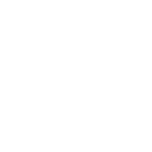
  
  
  
  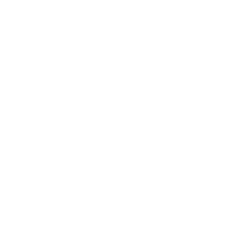
</p>

<p align="left">
  
  
  
  
  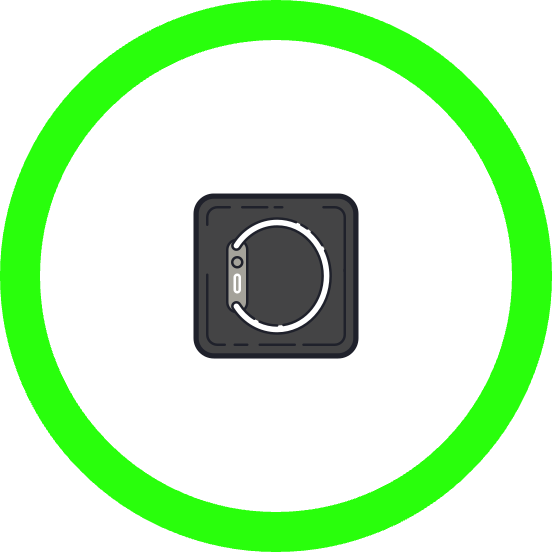
  
  
  
</p>

<p align="left">
  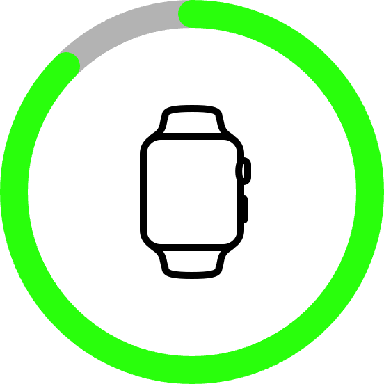
  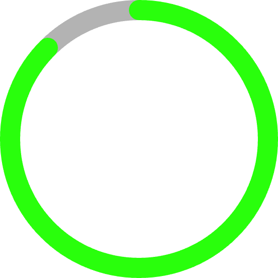
  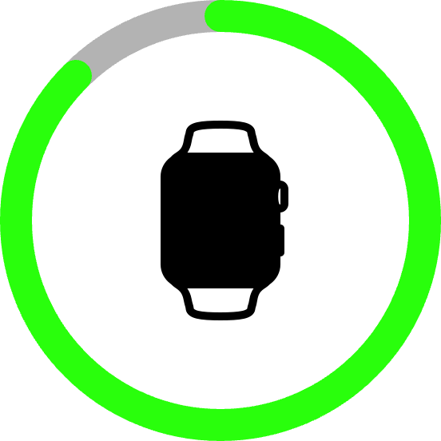
  
  
  
  
  
</p>


## iPad

<p align="left">
  
  
  
  
</p>


## iPhone

<p align="left">
  
  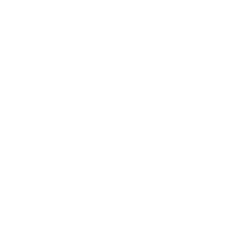
  
  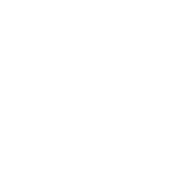
</p>


## Mac

<p align="left">
  
  
  
  
</p>


## MagicKeyboard

<p align="left">
  
  
  
  
</p>


## MagicTrackpad

<p align="left">
  
  
  
  
</p>


## MagicMouse

<p align="left">
  
  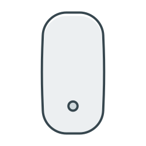
  
  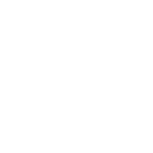
</p>


<p align="left">
  
  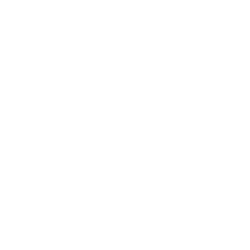
</p>


## bluetooth

<p align="left">
  
  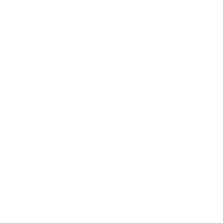
  
  
</p>

<p align="left">
  
  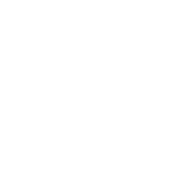
  
  
</p>


## Vision Pro

<p align="left">
  
  
  
  
</p>


# ring icon scripts

```shell
go run tool/merge/main.go ./icon/raw/AirPods ./icon/tool/batteryRing ./icon/batteryLevel/AirPods
go run tool/merge/main.go ./icon/raw/AppleWatch ./icon/tool/batteryRing ./icon/batteryLevel/AppleWatch
go run tool/merge/main.go ./icon/raw/iPad ./icon/tool/batteryRing ./icon/batteryLevel/iPad
go run tool/merge/main.go ./icon/raw/iPhone ./icon/tool/batteryRing ./icon/batteryLevel/iPhone
go run tool/merge/main.go ./icon/raw/Mac ./icon/tool/batteryRing ./icon/batteryLevel/Mac
go run tool/merge/main.go ./icon/raw/MagicKeyboard ./icon/tool/batteryRing ./icon/batteryLevel/MagicKeyboard
go run tool/merge/main.go ./icon/raw/MagicTrackpad ./icon/tool/batteryRing ./icon/batteryLevel/MagicTrackpad
go run tool/merge/main.go ./icon/raw/mouse ./icon/tool/batteryRing ./icon/batteryLevel/mouse
go run tool/merge/main.go ./icon/raw/bluetooth ./icon/tool/batteryRing ./icon/batteryLevel/bluetooth
go run tool/merge/main.go ./icon/raw/VisionPro ./icon/tool/batteryRing ./icon/batteryLevel/VisionPro
```